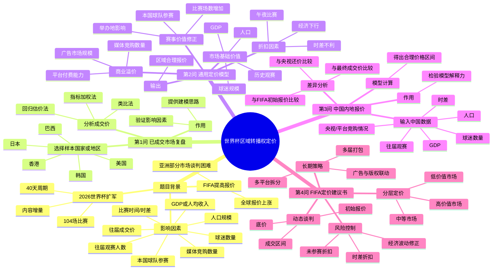

下面是对 **2026年北京理工大学数学建模竞赛第三级 A题：世界杯区域转播权定价** 的题目精读解析。题目核心是：**根据已成交国家/地区的转播权价格和影响因素，构建区域转播权定价模型，并用于中国内地报价分析与策略建议**。

---

# 一、逐句解析题目：背景信息 / 核心问题 / 已知条件 / 约束条件

| 题目内容                                                                     | 背景信息        | 核心问题            | 已知条件                         | 约束条件 / 隐含要求                       |
| ------------------------------------------------------------------------ | ----------- | --------------- | ---------------------------- | --------------------------------- |
| 2026年美加墨世界杯于6月11日开幕，决赛将于7月19日举行                                          | 说明赛事时间、举办周期 | 无直接建模问题         | 比赛周期约40天                     | 影响转播价值：赛事持续时间、观看时段、内容供给量          |
| 三国16个城市将共同承办104场比赛                                                       | 说明赛事规模扩大    | 赛事规模如何影响价格      | 104场比赛，16个城市                 | 比赛场数是定价的重要解释变量                    |
| 比赛场数比上届卡塔尔世界杯的64场增加了62.5%                                                | 给出与上一届对比    | 内容增量是否应转化为价格增长  | 上届64场，本届104场，增幅62.5%         | 可作为价格调整因子，但不能简单线性放大               |
| 赛事周期也相应延长至40天                                                            | 说明转播资源时长增加  | 周期延长是否提升版权价值    | 赛事周期40天                      | 也可能带来观众注意力分散，不能只看正向影响             |
| FIFA以赛事扩军、内容增量为由，提高了全球转播权报价                                              | 说明FIFA报价动机  | 如何判断FIFA报价是否合理  | 报价上涨的官方理由是扩军和内容增加            | 需要建立“合理价格”而非接受FIFA报价              |
| 美国：Fox Sports以4.8亿美元购得英语转播权，Telemundo支付4.65亿美元                           | 成交样本        | 可作为高价值市场参考      | 美国英语、美国西语两个成交价               | 同一地区不同语言权利需注意口径差异                 |
| 英国：BBC与ITV联合出资3.5亿美元获得2026、2030两届世界杯转播权                                  | 成交样本        | 可作为两届打包交易参考     | 英国两届3.5亿美元                   | 需要折算单届价格，考虑打包折扣                   |
| 日本：多个平台联合出资2亿美元左右购买2026届转播权                                              | 成交样本        | 亚洲发达市场参考        | 日本约2亿美元                      | “左右”说明数据不精确，需要容忍误差                |
| 韩国：JTBC支付约1.25亿美元购得2026届转播权                                              | 成交样本        | 亚洲市场参考          | 韩国约1.25亿美元                   | 可与日本、中国香港、越南等比较                   |
| 德国：两平台联合支付1.2亿美元获得2026、2030两届转播权，MagentaTV支付8000万美元获2026届转播权             | 成交样本        | 多平台、多权利包定价参考    | 德国存在两届包和单届包                  | 需识别不同权利类型，不宜直接相加或混用               |
| 越南：VTV支付1500万美元购得2026届转播权                                                | 成交样本        | 发展中市场参考         | 越南1500万美元                    | 可作为东南亚低价市场基准                      |
| 巴西：1.1亿美元购得2026届转播权                                                      | 成交样本        | 足球强国市场参考        | 巴西1.1亿美元                     | 本国足球热度和球队参赛因素重要                   |
| 澳大利亚：支付1500万美元左右购得2026届转播权                                               | 成交样本        | 中等收入但足球热度有限市场参考 | 澳大利亚约1500万美元                 | 人口、足球热度、时差会影响价格                   |
| 中国香港：电讯盈科支付约2500万美元购得2026届转播权                                            | 成交样本        | 中国区域市场参考        | 香港约2500万美元                   | 可作为中国内地估价的区域参照，但人口规模差异巨大          |
| FIFA向马来西亚、泰国、印度和中国分别报价5000万美元、1400万美元、1亿美元、超过2.5亿美元                      | 待谈判市场报价     | 报价是否偏高、如何合理定价   | 四个区域初始报价                     | 中国报价“超过2.5亿美元”，印度为2026+2030两届，需折算 |
| 因价格过高，且比赛时间都在这些地区的午夜，长时间未能达成协议                                           | 解释谈判受阻原因    | 定价模型是否应考虑观看时段折扣 | 价格高、午夜比赛                     | 时差是关键折扣因子；价格过高会降低成交概率             |
| 一个区域市场上如果有多家媒体竞购、本国球队参赛，或者人口较多、球迷较多、经济比较发达、往届观赛人数较多、往届转播权成交价，就会影响FIFA的报价 | 明确影响因素      | 如何把多因素转化为价格模型   | 媒体竞购、本国参赛、人口、球迷、经济、观赛人数、历史价格 | 这些是核心自变量；需要指标化、标准化和权重确定           |
| 请建立数学模型来解决如下问题                                                           | 总任务         | 建立区域转播权定价模型     | 需要使用公开数据                     | 必须有建模、估算、预测、解释和建议                 |

---

# 二、小问划分：直接目标与隐含目标

本题共有 **4个小问**，但它们不是并列关系，而是逐步递进关系。

| 小问  | 题目要求                                                  | 直接目标            | 隐含目标                        | 对后续问题的作用           |
| --- | ----------------------------------------------------- | --------------- | --------------------------- | ------------------ |
| 第1问 | 请选择一个已经达成协议的国家或地区，分析成交价的估算方法                          | 对一个已成交市场进行价格复盘  | 验证你选择的影响因素是否能解释真实成交价        | 为第2问建模提供样本和方法依据    |
| 第2问 | 假设你负责FIFA区域市场的转播权定价，请给出合理的转播权定价模型                     | 构建通用定价模型        | 把“人口、球迷、GDP、时差、参赛、竞购”等因素量化  | 是全文核心模型，为第3问直接服务   |
| 第3问 | 用模型计算2026年世界杯在中国内地的转播权报价，并分析与FIFA最初报价、央视还价和最终成交价之间的差异 | 计算中国内地合理报价并解释差异 | 不仅要算价格，还要解释谈判价格为何偏离模型价格     | 检验模型解释力，也是结果分析重点   |
| 第4问 | 给FIFA写一份不超过2页的建议书，介绍最合理的定价策略                          | 形成政策建议 / 商业建议   | 将模型结果转化为谈判策略、分区域报价策略、动态定价机制 | 是建模结果的应用输出，体现论文完整性 |

---

## 各小问的“表面任务—实际任务”拆解

| 小问  | 表面看起来在问什么 | 实际上需要完成什么                                    |
| --- | --------- | -------------------------------------------- |
| 第1问 | 估算某个国家成交价 | 选取一个代表性国家，构建“小样本解释模型”或“类比估价法”，说明真实价格从哪里来     |
| 第2问 | 建立定价模型    | 构建完整的区域价格函数，解决多指标权重、非线性修正、时差折扣、竞购溢价问题        |
| 第3问 | 算中国价格     | 用第2问模型落地计算，并解释“模型价、FIFA报价、央视还价、最终成交价”的差异     |
| 第4问 | 写建议书      | 把数学模型转化为FIFA可执行的商业定价策略，例如分层报价、动态报价、打包销售、风险折扣 |

---

# 三、逻辑关系梳理：思维导图



---

# 四、条件依赖关系梳理

这道题最容易出问题的地方是：学生会把所有因素简单堆进一个加权模型，但没有说明变量之间的依赖关系。实际上，本题变量之间有明显层级。

## 1. 价格形成的主逻辑

```text
赛事基础价值
    ↓
区域市场规模修正
    ↓
足球需求强度修正
    ↓
商业变现能力修正
    ↓
竞争溢价 / 时差折扣 / 参赛修正
    ↓
最终合理报价
```

---

## 2. 核心变量之间的依赖关系

| 上游变量        | 影响的中间变量     | 最终影响           |
| ----------- | ----------- | -------------- |
| 人口规模        | 潜在观众规模      | 提高基础价格         |
| 球迷数量        | 实际观看需求      | 提高版权吸引力        |
| GDP / 人均GDP | 广告收入、平台支付能力 | 提高商业变现上限       |
| 往届观赛人数      | 需求确定性       | 降低定价风险，提高报价可信度 |
| 本国球队是否参赛    | 观赛热度、媒体关注度  | 产生参赛溢价         |
| 多家媒体竞购      | 竞价强度        | 形成竞争溢价         |
| 比赛时间是否在午夜   | 实际观看人数      | 产生时差折扣         |
| 往届成交价       | 历史基准价       | 形成价格锚点         |
| 举办地与本国时差    | 黄金时段比例      | 影响观看便利度        |
| 赛事场次数量      | 可播内容数量      | 增加版权供给价值       |

---

## 3. 适合建模的变量分层

| 层级    | 变量                     | 建模作用       |
| ----- | ---------------------- | ---------- |
| 基础市场层 | 人口、GDP、人均GDP、广告市场规模    | 决定市场支付能力   |
| 足球需求层 | 球迷数量、往届观赛人数、搜索热度、足球排名  | 决定观看需求     |
| 赛事修正层 | 比赛场数、举办地、时区、本国参赛       | 决定本届赛事特殊价值 |
| 交易机制层 | 媒体数量、平台竞争、独播/联合购买、两届打包 | 决定成交溢价或折扣  |
| 历史锚定层 | 往届成交价、同类国家成交价          | 决定价格合理区间   |

---

# 五、题型分类与判断依据

## 总体判断

这道题不是单一题型，而是一个 **“评价 + 预测/估价 + 优化 + 策略建议”复合型商业定价建模题**。

| 小问  | 优化类         | 预测类         | 评价类    | 机理分析类    | 其他      | 判断依据                                  |
| --- | ----------- | ----------- | ------ | -------- | ------- | ------------------------------------- |
| 第1问 | □           | ☑ 回归/类比估价   | ☑ 指标解释 | ☑ 价格形成机理 | □       | 需要解释某个已成交价格如何形成，本质是成交价复盘与影响因素识别       |
| 第2问 | ☑ 可做单目标或多目标 | ☑ 回归/机器学习估价 | ☑ 指标体系 | ☑ 定价机理   | □       | 要建立通用定价模型，既可以预测合理报价，也可设计FIFA收益最大化价格   |
| 第3问 | □           | ☑ 区域价格预测    | ☑ 差异评价 | ☑ 谈判机制解释 | □       | 要计算中国内地报价，并解释模型价与现实谈判价之间的偏差           |
| 第4问 | ☑ 多目标策略优化   | □           | ☑ 策略评价 | ☑ 商业机制分析 | ☑ 建议书写作 | 要给FIFA提出定价策略，涉及收益、成交概率、公平性、谈判成本等多目标权衡 |

---

# 六、每问更具体的题型定位

## 第1问：已成交国家成交价估算

**题型定位：评价类 + 机理分析类 + 小样本估价类。**

判断依据：

| 依据         | 说明                        |
| ---------- | ------------------------- |
| 已有真实成交价    | 不是预测未知价格，而是解释已知价格         |
| 要“分析估算方法”  | 重点不是单纯算数，而是说明价格由哪些因素决定    |
| 可选择任意已成交国家 | 需要考虑样本代表性，如美国、日本、韩国、巴西、香港 |
| 适合方法       | 类比法、加权评分法、回归残差解释法、基准价格修正法 |

教学提醒：
这一问最好不要选数据太复杂的美国，因为美国有英语和西语两个版权包，口径复杂。课堂讲解时可以优先选 **韩国、日本、中国香港或巴西**，更容易建立清晰的单区域估价逻辑。

---

## 第2问：FIFA区域转播权定价模型

**题型定位：核心建模题，属于预测类 + 评价类 + 优化类。**

可以有三种建模路线：

| 路线                | 类型  | 适合学生水平 | 特点                      |
| ----------------- | --- | ------ | ----------------------- |
| 指标加权定价模型          | 评价类 | 基础组    | 易讲、稳妥、可解释性强             |
| 多元回归 / 岭回归 / 随机森林 | 预测类 | 进阶组    | 可利用已成交样本预测价格            |
| 收益最大化定价模型         | 优化类 | 高阶组    | 引入成交概率、FIFA收益最大化，更有竞赛深度 |

一个比较稳妥的模型形式是：

```text
合理报价 = 历史基准价 × 市场规模系数 × 足球热度系数 × 商业变现系数 × 赛事修正系数 × 竞购溢价系数 × 时差折扣系数
```

其中，时差折扣系数、本国参赛系数、媒体竞购系数是本题的亮点变量。

---

## 第3问：中国内地转播权报价

**题型定位：预测类 + 差异分析类。**

判断依据：

| 要求             | 实际建模含义             |
| -------------- | ------------------ |
| 用模型计算中国内地报价    | 预测未知或待验证价格         |
| 分析与FIFA最初报价的差异 | 判断FIFA报价是否存在战略性高开  |
| 分析与央视还价的差异     | 解释买方支付意愿与卖方报价之间的冲突 |
| 分析与最终成交价的差异    | 验证模型合理性，并解释谈判修正因素  |

这一问不能只给一个数字，最好给 **价格区间**：

```text
保守价：考虑午夜时差、国足未参赛、独家买方议价能力
基准价：按模型正常估计
进取价：考虑中国人口规模、世界杯热度、广告市场价值
```

这样更符合真实商业谈判。

---

## 第4问：FIFA定价建议书

**题型定位：策略优化类 + 建议书写作类。**

判断依据：

| 要求         | 实际任务            |
| ---------- | --------------- |
| 写给FIFA     | 面向决策者，不是单纯数学推导  |
| 不超过2页      | 要简洁、可执行、商业化     |
| 最合理的定价策略   | 需要从模型结果上升到策略    |
| 每届价格都会变动   | 需要动态定价，而不是固定公式  |
| 磋商花费大量时间精力 | 需要降低谈判成本，提高成交效率 |

建议书中应体现：

| 策略   | 含义                     |
| ---- | ---------------------- |
| 分层定价 | 将市场分为高价值、中价值、低价值市场     |
| 动态折扣 | 对午夜比赛、未参赛国家、经济下行市场给予折扣 |
| 多届打包 | 对稳定市场出售2026+2030组合版权   |
| 竞价机制 | 对多平台市场采用公开竞标或分包销售      |
| 底价机制 | 设置模型底价、目标价和谈判上限        |
| 风险修正 | 根据汇率、经济波动、球队参赛概率调整报价   |

---

# 七、这道题的本质建模路线

这道题表面是“世界杯转播权价格”，本质是一个：

```text
区域市场商业价值评估 + 赛事内容价值修正 + 谈判定价策略设计
```

最适合的论文主线是：

| 章节    | 核心内容                                      |
| ----- | ----------------------------------------- |
| 问题分析  | 解释转播权价格由市场规模、足球热度、商业变现、赛事因素和谈判机制共同决定      |
| 数据收集  | 收集各国人口、GDP、人均GDP、足球热度、观赛人数、媒体数量、历史成交价、时差等 |
| 第1问模型 | 选择一个国家，用基准修正法复盘成交价                        |
| 第2问模型 | 建立区域转播权综合定价模型                             |
| 第3问应用 | 计算中国内地合理报价，并与FIFA报价、央视还价、最终成交价比较          |
| 第4问建议 | 提出FIFA动态分层定价策略                            |

---

# 八、课堂讲解时可以强调的“坑点”

| 常见错误         | 为什么错              | 正确处理                   |
| ------------ | ----------------- | ---------------------- |
| 直接按人口比例给中国定价 | 人口多不等于观看付费能力强     | 人口要与足球热度、观看时段、商业变现共同考虑 |
| 把所有国家成交价直接回归 | 样本少、口径不统一         | 先统一单届价格、是否打包、是否多语言权利   |
| 忽略时差         | 亚洲市场谈判困难的关键就在午夜比赛 | 设置时差折扣因子               |
| 忽略本国球队参赛     | 本国参赛会显著提升观赛需求     | 设置参赛溢价因子               |
| 只给点估计        | 商业谈判价格本来有区间       | 给保守价、基准价、进取价           |
| 第4问写成空泛建议    | 建议书必须基于模型结果       | 将模型变量转化为FIFA定价规则       |

---

# 九、最终题型总结

这道题可以概括为：

> **以世界杯转播权成交价为样本，构建区域市场综合价值评价体系，并进一步建立转播权动态定价模型，最后用于中国内地报价预测与FIFA定价策略优化。**

最推荐的建模组合是：

| 模块    | 推荐方法                        |
| ----- | --------------------------- |
| 数据预处理 | 统一货币、统一单届价格、标准化指标           |
| 第1问   | 基准价格修正法 / 类比估价法             |
| 第2问   | 熵权-TOPSIS + 多元回归 / 指标加权定价模型 |
| 第3问   | 中国市场价格区间预测 + 敏感性分析          |
| 第4问   | 分层动态定价策略 + 多目标优化思想          |

这道题的核心不是“找一个公式算价格”，而是要回答：

```text
FIFA为什么敢报这个价？
买方为什么觉得贵？
合理成交价应该落在哪个区间？
未来如何减少反复谈判成本？
```
