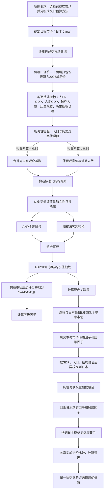

# 第一问数学模型建立步骤：基于分层动态参考市场的日本世界杯转播权成交价复盘模型

## 一、模型定位与建模目标

第一问要求选择一个已经达成协议的国家或地区，分析其世界杯区域转播权成交价的估算方法。根据题目给出的背景，转播权价格通常受到人口规模、经济发展水平、球迷数量、往届观赛人数、历史转播权成交价、媒体竞购程度以及本国球队是否参赛等因素影响。因此，本文选择已经达成协议的日本市场作为研究对象，建立日本 2026 年世界杯转播权成交价的复盘估算模型。

需要注意的是，第一问并不是完全意义上的“未知市场预测”，而是一个**事后解释型模型**。日本成交价已经给出，模型任务不是替代真实成交价，而是回答：

> 日本市场为什么能够形成这一成交价？
> 哪些因素支撑了该成交价？
> 若用其他已成交市场作为参照，日本价格应如何被估算出来？

因此，本文建立的模型称为：

**分层动态参考市场成交价复盘模型。**

其核心思想是：

1. 先构建各国或地区的结构价值指标；
2. 用 AHP-熵权法确定指标权重；
3. 用 TOPSIS 得到各市场的结构价值指数；
4. 用灰色关联度寻找与日本最相似的参考市场；
5. 剥离参考市场成交价中的动态因子和市场层级因子；
6. 根据日本与参考市场之间的 GDP、人口、结构价值差异进行校准；
7. 最后回乘日本自身的动态因子和层级因子，得到日本成交价的模型复盘值。

---

## 二、模型准备

### 2.1 研究对象

设日本为目标市场，记为：

[
j=\text{Japan}
]

模型最终要求估算日本市场 2026 年世界杯转播权成交价：

[
\hat{P}_j
]

其中价格单位统一为：

[
\text{百万美元}
]

### 2.2 样本市场范围

代码中第一问使用的已成交样本市场包括：

[
M={\text{美国、英国、日本、韩国、德国、越南、巴西、澳大利亚、中国香港}}
]

这些市场均已完成 2026 年世界杯转播权交易，具有可比成交价格。

### 2.3 数据准备

模型需要整理七类数据：

| 数据类型           | 作用                               |
| -------------- | -------------------------------- |
| 2026 年转播权成交价数据 | 提供各市场真实成交价                       |
| 历史转播权价格数据      | 衡量该市场过往版权价值基础                    |
| 经济指标数据         | 提供人口、GDP、人均 GDP、体育媒体市场规模等变量      |
| 足球市场指标数据       | 提供球迷人数、球迷占比、FIFA 排名、联赛强度、是否参赛等变量 |
| 世界杯历史观赛数据      | 构造历史观赛代理值                        |
| 时区与观赛便利度数据     | 衡量比赛时间对观众收看的影响                   |
| 市场结构数据         | 补充媒体竞争、竞购方数量、市场成熟度等信息            |

### 2.4 价格口径统一

由于部分市场购买的是 2026、2030 两届世界杯打包版权，而日本购买的是 2026 单届版权，因此需先将所有价格统一折算为 2026 单届口径。

若某市场成交价为两届打包价格 (P_m^{bundle})，折现率为 (r=4%)，两届世界杯间隔 4 年，则单届折算价格为：

[
P_m=\frac{P_m^{bundle}}{1+(1+r)^{-4}}
]

若某市场本身就是 2026 单届版权，则：

[
P_m=P_m^{single}
]

该步骤的物理意义是：
**消除不同市场版权套餐期限不同造成的价格不可比问题。**

---

## 三、变量定义

### 3.1 决策变量与待选参数

第一问是复盘解释模型，不存在传统意义上的企业生产决策变量。模型中的“决策变量”主要是用于估价公式的待选超参数。

| 符号         | 名称         | 类型      | 单位 | 取值范围                    | 含义                            |
| ---------- | ---------- | ------- | -- | ----------------------- | ----------------------------- |
| (k)        | 参考市场数量     | 离散变量    | 个  | (k\in{2,3,4})           | 从灰色关联度最高的市场中选取前 (k) 个作为日本参考市场 |
| (\alpha)   | 结构价格弹性系数   | 连续型网格参数 | 无  | ([0.40,1.40])           | 衡量结构价值指数差异对价格的放大或缩小作用         |
| (\gamma_1) | GDP 对数敏感系数 | 连续型网格参数 | 无  | ([0.05,0.30])           | 衡量 GDP 总量差异对价格的平滑修正作用         |
| (\gamma_2) | 人口对数敏感系数   | 连续型网格参数 | 无  | ([0.05,0.25])           | 衡量人口规模差异对价格的平滑修正作用            |
| (\eta)     | 市场层级溢价强度   | 离散型网格参数 | 无  | ({0.15,0.20,0.25,0.30}) | 衡量市场层级高低对价格溢价的影响              |

### 3.2 原始变量

| 符号       | 名称              | 类型   | 单位      | 约束范围           | 含义              |
| -------- | --------------- | ---- | ------- | -------------- | --------------- |
| (P_m)    | 市场 (m) 的统一口径成交价 | 连续变量 | 百万美元    | (P_m>0)        | 2026 单届转播权成交价格  |
| (GDP_m)  | GDP 总量          | 连续变量 | 十亿美元    | (GDP_m>0)      | 衡量市场总体经济体量      |
| (Pop_m)  | 人口规模            | 连续变量 | 百万人     | (Pop_m>0)      | 衡量潜在观众基础        |
| (gpc_m)  | 人均 GDP          | 连续变量 | 美元      | (gpc_m>0)      | 衡量居民支付能力与广告价值   |
| (Fan_m)  | 球迷人数            | 连续变量 | 百万人     | (Fan_m\geq 0)  | 衡量足球消费群体规模      |
| (View_m) | 历史观赛代理值         | 连续变量 | 百万人或折算值 | (View_m\geq 0) | 衡量往届世界杯收视基础     |
| (HisP_m) | 历史转播权价格         | 连续变量 | 百万美元    | (HisP_m>0)     | 衡量该市场历史版权价值锚点   |
| (Q_m)    | 是否本国球队参赛        | 二元变量 | 无       | (Q_m\in{0,1})  | 参赛会提高本国观众关注度    |
| (B_m)    | 媒体竞购强度          | 离散变量 | 无       | (B_m\geq1)     | 衡量媒体竞购激烈程度      |
| (T_m)    | 比赛时段友好度         | 连续变量 | 无       | (T_m\in[0,1])  | 衡量当地观众收看比赛的便利程度 |
| (N_m)    | 广播商数量           | 离散变量 | 家       | (N_m\geq1)     | 衡量权利结构复杂度和覆盖广度  |

### 3.3 中间变量

| 符号               | 名称       | 类型   | 单位   | 约束范围                      | 含义                        |
| ---------------- | -------- | ---- | ---- | ------------------------- | ------------------------- |
| (A_m)            | 潜在观众基数   | 连续变量 | 无    | (A_m\geq0)                | 将人口和历史观赛代理值合并后的观众潜力指标     |
| (H_m^{football}) | 足球热度指数   | 连续变量 | 无    | ([0,1])                   | 综合 FIFA 排名、球迷占比、球迷人数、联赛强度 |
| (x_{mi})         | 标准化指标值   | 连续变量 | 无    | ([0,1])                   | 市场 (m) 在指标 (i) 上的无量纲值     |
| (w_i^{AHP})      | AHP 主观权重 | 连续变量 | 无    | ([0,1])                   | 专家判断得到的指标重要性              |
| (w_i^{E})        | 熵权法客观权重  | 连续变量 | 无    | ([0,1])                   | 数据差异程度决定的客观权重             |
| (w_i)            | 组合权重     | 连续变量 | 无    | ([0,1])，(\sum w_i=1)      | 综合主观与客观信息后的最终权重           |
| (C_m)            | 结构价值指数   | 连续变量 | 无    | ([0,1])                   | TOPSIS 得到的市场结构价值          |
| (G_{mj})         | 灰色关联度    | 连续变量 | 无    | ([0,1])                   | 市场 (m) 与日本市场 (j) 的结构相似度   |
| (\pi_{mj})       | 灰色关联权重   | 连续变量 | 无    | ([0,1])，(\sum \pi_{mj}=1) | 参考市场对日本估价的贡献权重            |
| (L_m)            | 市场层级     | 离散变量 | 无    | (L_m\in{1,2,3,4,5})       | 表示市场处于 D、C、B、A、S 层级       |
| (\Lambda_m)      | 层级因子     | 连续变量 | 无    | (\Lambda_m>0)             | 反映高层级市场的版权溢价              |
| (\Phi_m)         | 动态修正总因子  | 连续变量 | 无    | (\Phi_m>0)                | 综合参赛、竞购、时差、权利结构等短期因素      |
| (P_m^{base})     | 参考市场基准价格 | 连续变量 | 百万美元 | (P_m^{base}>0)            | 从成交价中剥离动态因子和层级因子后的基础价格    |

### 3.4 目标变量

| 符号          | 名称        | 类型   | 单位   | 约束范围          | 含义                      |
| ----------- | --------- | ---- | ---- | ------------- | ----------------------- |
| (\hat{P}_j) | 日本模型复盘成交价 | 连续变量 | 百万美元 | (\hat{P}_j>0) | 模型估算出的日本 2026 年世界杯转播权价格 |
| (e_j)       | 相对误差      | 连续变量 | 无    | (e_j\geq0)    | 模型复盘值与真实成交价之间的相对偏差      |

---

## 四、模型假设

### 假设 1：已成交市场价格能够反映市场真实版权价值

认为美国、英国、日本、韩国、德国等已成交市场的成交价，是 FIFA 与当地媒体在综合市场需求、支付能力、竞争程度和赛事价值之后形成的结果。

合理性：
第一问是事后复盘问题，使用已成交市场作为参考，有助于解释日本价格的形成逻辑。

---

### 假设 2：转播权价格与市场结构价值正相关

人口规模、球迷人数、人均 GDP、历史观赛基础、足球热度、历史版权价格等指标越高，该市场的世界杯版权价值通常越高。

合理性：
这些变量分别对应潜在观众规模、广告变现能力、付费能力、历史需求基础和体育文化基础，均会影响媒体购买转播权的意愿。

---

### 假设 3：相似市场之间具有可比性

若两个市场在经济能力、足球热度、观众基础和历史版权价格等结构指标上相似，则它们的版权价格形成机制也具有可比性。

合理性：
日本不能直接与所有市场平均比较。例如美国市场规模远大于日本，越南市场经济体量和版权生态又明显不同。因此需要通过灰色关联度筛选相似参考市场。

---

### 假设 4：成交价可以分解为结构基准价格、动态因子和层级因子

认为某市场成交价可以表示为：

[
P_m=P_m^{base}\cdot \Phi_m\cdot \Lambda_m
]

其中 (P_m^{base}) 表示市场长期结构价值，(\Phi_m) 表示短期动态因素，(\Lambda_m) 表示市场层级溢价。

合理性：
转播权价格既受长期市场结构影响，也受当届世界杯参赛情况、竞购强度、时差友好度、权利包复杂度等短期因素影响。将二者分离有助于提高解释清晰度。

---

### 假设 5：打包版权可以通过折现方式折算为单届价格

对于 2026、2030 两届打包成交价，假设两届赛事价值相近，并采用折现率 (r=4%) 将未来一届价格折算到当前。

合理性：
如果不进行折算，则两届打包价会被误认为单届价格，导致英国、德国等市场与日本单届版权不可比。

---

## 五、模型公式推导

### 5.1 成交价统一口径处理

对于市场 (m)，若其价格为两届打包价格，则：

[
P_m=\frac{P_m^{bundle}}{1+(1+r)^{-4}}
]

其中：

[
r=0.04
]

若其为单届版权价格，则：

[
P_m=P_m^{single}
]

物理意义：
将所有市场的价格统一为“2026 单届世界杯版权价格”，保证横向可比。

---

### 5.2 构造历史观赛代理值

若某市场有 2018 年和 2022 年世界杯观赛数据，则取其均值作为历史观赛代理基础：

[
View_m=\frac{View_{m,2018}+View_{m,2022}}{2}
]

若数据单位不同，则先进行单位折算后再合并。

物理意义：
历史观赛人数代表该市场对世界杯内容的真实消费基础。

---

### 5.3 观众类指标相关性检验与合并

模型先检验人口规模与历史观赛代理值之间的对数相关系数：

[
\rho_{PV}=\text{Corr}\left(\ln(1+Pop_m),\ln(1+View_m)\right)
]

若：

[
\rho_{PV}>0.85
]

说明人口规模和历史观赛代理值高度相关，直接同时放入模型会造成信息重复。因此构造潜在观众基数：

[
A_m=\sqrt{\ln(1+Pop_m)\cdot \ln(1+View_m)}
]

若：

[
\rho_{PV}\leq 0.85
]

则不合并，分别保留历史观赛代理值和球迷人数等指标。

物理意义：
该步骤用于控制观众类变量的共线性，避免模型重复计算人口和观赛规模的影响。

---

### 5.4 构造足球热度指数

足球热度指数由 FIFA 排名、球迷占比、球迷人数和国内联赛强度共同构成。

首先定义 FIFA 排名得分：

[
RankScore_m=\frac{Rank_{\max}+1-Rank_m}{Rank_{\max}}
]

其中 (Rank_m) 越小，说明球队排名越高，因此得分越高。

然后构造足球热度指数：

[
H_m^{football}
==============

0.25RankScore_m
+0.25FanRate_m^{norm}
+0.30\ln(1+Fan_m)^{norm}
+0.20League_m^{norm}
]

其中上标 (norm) 表示经过极差标准化后的数值。

物理意义：
足球热度指数衡量一个市场对世界杯内容的基础偏好。日本作为世界杯常客，且拥有稳定球迷基础，该指标是解释其版权价格的重要依据。

---

### 5.5 构造比赛时段友好度

世界杯在美加墨举办，亚洲市场存在时差劣势。因此模型将时差影响纳入动态修正。

设：

[
TimeScore_m
]

为人工整理的 1 至 5 分观赛便利度评分，

[
PrimePct_m
]

为黄金时段比赛比例，则比赛时段友好度为：

[
T_m=0.6\cdot \frac{TimeScore_m}{5}
+0.4\cdot \frac{PrimePct_m}{100}
]

物理意义：
若比赛多在当地深夜进行，则观赛便利度低，版权价格应受到折扣影响。

---

### 5.6 指标标准化

对所有正向指标进行极差标准化：

[
x_{mi}=\frac{z_{mi}-\min_m z_{mi}}{\max_m z_{mi}-\min_m z_{mi}}
]

其中 (z_{mi}) 为市场 (m) 在指标 (i) 上的原始或对数化指标值。

对于规模型变量，例如人口、球迷人数、历史价格等，先进行对数变换：

[
z_{mi}=\ln(1+X_{mi})
]

再标准化。

物理意义：
对数变换可以削弱美国等超大市场的极端值影响，极差标准化则保证各指标处于同一量纲。

---

### 5.7 AHP 主观赋权

设指标集合为：

[
I={1,2,\dots,n}
]

每个指标根据其理论重要性给定基础评分 (s_i)。代码中使用的基础评分包括：

| 指标      | 基础重要性评分 |
| ------- | ------- |
| 潜在观众基数  | 8       |
| 历史观赛代理值 | 7       |
| 球迷人数    | 8       |
| 人均 GDP  | 6       |
| 足球热度指数  | 8       |
| 历史转播权价格 | 8       |

构造 AHP 判断矩阵：

[
a_{ij}=\frac{s_i}{s_j}
]

再求最大特征值对应的特征向量：

[
Aw=\lambda_{\max}w
]

归一化后得到 AHP 主观权重：

[
w_i^{AHP}=\frac{w_i}{\sum_{i=1}^n w_i}
]

一致性指标为：

[
CI=\frac{\lambda_{\max}-n}{n-1}
]

一致性比例为：

[
CR=\frac{CI}{RI}
]

若：

[
CR<0.10
]

则判断矩阵通过一致性检验。

物理意义：
AHP 反映建模者对指标重要性的理论判断，避免完全依赖小样本数据。

---

### 5.8 熵权法客观赋权

标准化指标矩阵为：

[
X=(x_{mi})
]

先计算第 (i) 个指标下市场 (m) 的占比：

[
p_{mi}=\frac{x_{mi}}{\sum_{m=1}^{N}x_{mi}}
]

再计算指标熵值：

[
e_i=-\frac{1}{\ln N}\sum_{m=1}^{N}p_{mi}\ln p_{mi}
]

差异系数为：

[
d_i=1-e_i
]

熵权法权重为：

[
w_i^E=\frac{d_i}{\sum_{i=1}^{n}d_i}
]

物理意义：
某指标在不同市场之间差异越大，说明其区分能力越强，客观权重越高。

---

### 5.9 主客观组合赋权

模型使用组合赋权法：

[
w_i=\lambda w_i^{AHP}+(1-\lambda)w_i^E
]

其中：

[
\lambda=0.5
]

并进行归一化：

[
\sum_{i=1}^{n}w_i=1
]

物理意义：
组合权重同时吸收主观理论判断和客观数据差异，避免单一赋权方法的偏差。

---

### 5.10 TOPSIS 结构价值指数

先计算加权标准化矩阵：

[
v_{mi}=w_i x_{mi}
]

正理想解为：

[
v_i^+=\max_m v_{mi}
]

负理想解为：

[
v_i^-=\min_m v_{mi}
]

市场 (m) 到正理想解的距离为：

[
D_m^+=\sqrt{\sum_{i=1}^{n}(v_{mi}-v_i^+)^2}
]

市场 (m) 到负理想解的距离为：

[
D_m^-=\sqrt{\sum_{i=1}^{n}(v_{mi}-v_i^-)^2}
]

定义结构价值指数：

[
C_m=\frac{D_m^-}{D_m^++D_m^-}
]

其中：

[
C_m\in[0,1]
]

物理意义：
(C_m) 越接近 1，说明该市场越接近理想高价值市场；越接近 0，说明其结构价值越弱。

---

### 5.11 市场层级划分

仅靠 TOPSIS 指数不足以反映市场所处层级。因此模型进一步引入市场层级。

选取以下变量：

[
GDP_m,\ Pop_m,\ SportsMedia_m,\ HisP_m,\ Bidder_m,\ RightComplexity_m
]

对其取对数或标准化后得到：

[
Z_{m1},Z_{m2},\dots,Z_{m6}
]

定义市场层级评分：

[
S_m=\frac{1}{6}\sum_{q=1}^{6}Z_{mq}
]

根据评分分位数将市场划分为五层：

| 层级数值 | 层级标签 | 含义      |
| ---- | ---- | ------- |
| 5    | S    | 全球顶级市场  |
| 4    | A    | 高价值成熟市场 |
| 3    | B    | 中高价值市场  |
| 2    | C    | 区域型市场   |
| 1    | D    | 小型或新兴市场 |

然后结合人工规则对部分典型市场进行修正。日本被划入 A 层，即：

[
L_j=4
]

定义层级因子：

[
\Lambda_m=\exp\left[\eta(L_m-3)\right]
]

物理意义：
当 (L_m>3) 时，市场高于中位层级，存在层级溢价；当 (L_m<3) 时，市场低于中位层级，存在层级折扣。

---

### 5.12 动态修正因子

动态修正因子由参赛因子、竞购因子、时差因子和权利结构因子组成。

#### 5.12.1 参赛因子

若本国球队参赛：

[
QF_m=1+0.10
]

若未参赛：

[
QF_m=1-0.05
]

参赛因素最终以弹性形式进入模型：

[
QF_m^{\beta}
]

其中：

[
\beta=0.25
]

物理意义：
本国球队参赛会提升观众关注度，但这种提升不是完全线性的，因此使用小于 1 的弹性指数。

---

#### 5.12.2 竞购因子

设媒体竞购强度为 (B_m)，则：

[
BF_m=1+0.08(B_m-1)
]

物理意义：
竞购越激烈，FIFA 议价能力越强，最终成交价越高。

---

#### 5.12.3 时差因子

比赛时段友好度为 (T_m)，则：

[
TF_m=0.65+0.35T_m
]

物理意义：
即使时差不友好，世界杯仍具有基础观赛需求，因此时差因子设置了 0.65 的下限基础。

---

#### 5.12.4 权利结构因子

若广播商数量为 (N_m)，则：

[
RF_m=1+0.04(N_m-1)
]

物理意义：
广播商越多，说明版权拆分、平台覆盖和市场开发程度越高，价格应存在一定加成。

---

#### 5.12.5 动态修正总因子

综合得到：

[
\Phi_m=QF_m^{\beta}\cdot BF_m\cdot TF_m\cdot RF_m
]

物理意义：
(\Phi_m) 反映当届世界杯中，短期事件和交易结构对市场价格的综合影响。

---

### 5.13 参考市场筛选约束

为了避免日本与差异过大的市场直接比较，模型首先根据市场层级筛选候选参考市场。

日本目标市场为 (j)，候选参考市场集合为：

[
R_j={m\in M,\ m\neq j,\ |L_m-L_j|\leq 1}
]

若该集合为空，则退化为：

[
R_j=M-{j}
]

物理意义：
日本属于 A 层市场，因此优先与 S、A、B 层市场比较，而不是直接与 D 层市场比较。

---

### 5.14 灰色关联度计算

对候选参考市场 (m\in R_j)，计算其与日本在各指标上的绝对差：

[
\Delta_{mi}=|x_{mi}-x_{ji}|
]

记：

[
\Delta_{\min}=\min_{m,i}\Delta_{mi}
]

[
\Delta_{\max}=\max_{m,i}\Delta_{mi}
]

灰色关联系数为：

[
\xi_{mi}=
\frac{\Delta_{\min}+\rho\Delta_{\max}}
{\Delta_{mi}+\rho\Delta_{\max}}
]

其中分辨系数：

[
\rho=0.5
]

灰色关联度为：

[
G_{mj}=\sum_{i=1}^{n}w_i\xi_{mi}
]

选择灰色关联度最高的前 (k) 个市场作为日本参考市场。

物理意义：
灰色关联度越高，说明该市场在指标结构上越接近日本，对日本价格复盘的参考意义越强。

---

### 5.15 灰色关联权重

对于入选的参考市场集合 (K_j)，定义灰色关联权重：

[
\pi_{mj}=\frac{G_{mj}}{\sum_{m\in K_j}G_{mj}}
]

并满足：

[
\sum_{m\in K_j}\pi_{mj}=1
]

物理意义：
越相似的市场，在日本价格估算中的权重越高。

---

### 5.16 剥离参考市场动态因素与层级因素

参考市场真实成交价为 (P_m)。由于其中包含该市场自身的动态因子和层级因子，因此需先还原为基准价格：

[
P_m^{base}=\frac{P_m}{\Phi_m\Lambda_m}
]

物理意义：
该步骤相当于把参考市场价格中的“参赛、竞购、时差、权利结构、层级溢价”剥离出来，只保留长期结构基准价格。

---

### 5.17 GDP 与人口体量平滑修正

日本与参考市场在经济体量和人口规模上存在差异。设日本为 (j)，参考市场为 (m)，定义体量平滑乘数：

[
V_{m\to j}
==========

\max\left[
0.1,\
1+\gamma_1\ln\left(\frac{GDP_j}{GDP_m}\right)
+\gamma_2\ln\left(\frac{Pop_j}{Pop_m}\right)
\right]
]

物理意义：
如果日本 GDP 或人口高于参考市场，则价格应上调；反之则下调。使用对数形式是为了避免美国等超大市场造成过度放大。

---

### 5.18 结构价值弹性修正

设日本结构价值指数为 (C_j)，参考市场结构价值指数为 (C_m)，定义结构价值弹性项：

[
E_{m\to j}
==========

\left(\frac{C_j}{C_m}\right)^{\alpha}
]

物理意义：
若日本结构价值高于参考市场，则基准价格上调；若低于参考市场，则基准价格下调。参数 (\alpha) 控制结构价值差异向价格差异传导的强度。

---

### 5.19 参考市场校准后的日本基准价格

对于参考市场 (m)，其校准到日本后的基准价格为：

[
\tilde{P}_{m\to j}^{base}
=========================

P_m^{base}
\cdot V_{m\to j}
\cdot E_{m\to j}
]

物理意义：
该式表示：以参考市场的基准价格为起点，按照日本与参考市场之间的经济体量差异和结构价值差异进行修正。

---

### 5.20 多参考市场加权融合

将多个参考市场的校准结果按灰色关联权重加权求和：

[
\hat{P}_j^{base}
================

\sum_{m\in K_j}\pi_{mj}\tilde{P}_{m\to j}^{base}
]

物理意义：
日本基准价格不是由单一市场决定，而是由多个相似市场共同给出。

---

### 5.21 回乘日本动态因子与层级因子

最后，将日本自身的动态修正总因子和市场层级因子回乘，得到日本成交价复盘值：

[
\hat{P}_j=
\hat{P}_j^{base}
\cdot \Phi_j
\cdot \Lambda_j
]

物理意义：
日本最终成交价不仅取决于长期结构基准价值，还取决于日本本届世界杯中的参赛情况、时差条件、媒体竞购程度、广播商结构和 A 层市场溢价。

---

### 5.22 误差评价

设日本真实成交价为 (P_j)，模型复盘值为 (\hat{P}_j)，则绝对误差为：

[
AE_j=|\hat{P}_j-P_j|
]

相对误差为：

[
RE_j=\frac{|\hat{P}_j-P_j|}{P_j}
]

物理意义：
相对误差越小，说明模型对日本成交价形成机制的解释越接近真实成交结果。

---

## 六、参数寻优方法

模型需要确定参数组合：

[
\theta=(k,\alpha,\gamma_1,\gamma_2,\eta)
]

代码采用网格搜索与留一法交叉验证进行参数选择。

### 6.1 参数网格

[
k\in{2,3,4}
]

[
\alpha\in{0.40,0.50,\dots,1.40}
]

[
\gamma_1\in{0.05,0.10,\dots,0.30}
]

[
\gamma_2\in{0.05,0.10,\dots,0.25}
]

[
\eta\in{0.15,0.20,0.25,0.30}
]

### 6.2 留一法目标函数

对每一个市场 (m)，将其视为目标市场，用其他市场作为参考市场，得到预测值：

[
\hat{P}_m^{(-m)}(\theta)
]

计算平均相对误差：

[
Loss(\theta)
============

\frac{1}{N}
\sum_{m=1}^{N}
\frac{
|\hat{P}_m^{(-m)}(\theta)-P_m|
}{P_m}
]

选择使平均相对误差最小的参数组合：

[
\theta^*
========

\arg\min_{\theta}Loss(\theta)
]

物理意义：
留一法可以检验模型对不同已成交市场的复盘能力，避免只为日本一个市场手动调参。

---

## 七、模型约束条件总结

### 7.1 价格约束

[
P_m>0,\quad \hat{P}_j>0
]

所有成交价和预测价均为正。

---

### 7.2 标准化约束

[
0\leq x_{mi}\leq1
]

所有标准化指标均落在 ([0,1]) 区间。

---

### 7.3 权重约束

[
0\leq w_i\leq1
]

[
\sum_{i=1}^{n}w_i=1
]

组合权重必须非负且总和为 1。

---

### 7.4 AHP 一致性约束

[
CR<0.10
]

若一致性比例不满足要求，则需重新调整 AHP 判断矩阵。

---

### 7.5 参考市场层级约束

[
R_j={m\in M,\ m\neq j,\ |L_m-L_j|\leq1}
]

优先选择与日本同层或相邻层市场作为参考。

---

### 7.6 参考市场数量约束

[
k\in{2,3,4}
]

模型最多选择 4 个参考市场，避免小样本下过多低相关市场进入估价过程。

---

### 7.7 灰色权重约束

[
0\leq \pi_{mj}\leq1
]

[
\sum_{m\in K_j}\pi_{mj}=1
]

参考市场贡献权重之和为 1。

---

### 7.8 体量平滑乘数下限约束

[
V_{m\to j}\geq0.1
]

防止由于 GDP 或人口差异过大导致校准价格变为负数或过小。

---

## 八、建模流程图

---

## 九、模型求解步骤

### 第一步：读取并清洗成交价数据

读取 2026 年转播权成交价数据，保留已确认成交且属于第一问样本范围的市场。对价格区间取均值，对两届打包价格折算为单届价格。

输出：

[
P_m
]

---

### 第二步：合并经济、足球、时区和市场结构数据

将经济指标、足球市场指标、时区便利度、市场成熟度、历史转播权价格、历史观赛数据与成交价数据按照国家或地区名称进行匹配。

输出综合数据表：

[
Data_m=(P_m,GDP_m,Pop_m,Fan_m,View_m,HisP_m,\dots)
]

---

### 第三步：构造模型指标

构造以下核心解释指标：

1. 潜在观众基数；
2. 人均 GDP；
3. 足球热度指数；
4. 历史转播权价格；
5. 历史观赛代理值或球迷人数；
6. 比赛时段友好度；
7. 媒体竞购强度；
8. 市场层级变量；
9. 动态修正变量。

---

### 第四步：标准化指标矩阵

对入模结构指标进行对数化和极差标准化，得到：

[
X=(x_{mi})
]

该矩阵用于后续赋权、TOPSIS 和灰色关联分析。

---

### 第五步：计算组合权重

先通过 AHP 得到主观权重：

[
w_i^{AHP}
]

再通过熵权法得到客观权重：

[
w_i^E
]

最后得到组合权重：

[
w_i=0.5w_i^{AHP}+0.5w_i^E
]

---

### 第六步：计算结构价值指数

使用 TOPSIS 计算每个市场的结构价值指数：

[
C_m=\frac{D_m^-}{D_m^++D_m^-}
]

该指数用于衡量市场长期结构价值。

---

### 第七步：划分市场层级

根据 GDP、人口、体育媒体市场规模、历史版权价格、竞购方数量和权利结构复杂度计算层级评分：

[
S_m
]

并将市场划分为：

[
S,A,B,C,D
]

日本属于 A 层市场，对应：

[
L_j=4
]

---

### 第八步：计算动态修正因子

分别计算参赛因子、竞购因子、时差因子和权利结构因子：

[
\Phi_m=QF_m^{\beta}\cdot BF_m\cdot TF_m\cdot RF_m
]

该因子用于描述当届世界杯短期交易环境。

---

### 第九步：筛选日本参考市场

先根据市场层级筛选：

[
|L_m-L_j|\leq1
]

再计算灰色关联度：

[
G_{mj}
]

选择灰色关联度最高的前 (k) 个市场作为日本参考市场。

---

### 第十步：从参考市场成交价中剥离动态与层级影响

对每个参考市场计算：

[
P_m^{base}=\frac{P_m}{\Phi_m\Lambda_m}
]

得到参考市场的长期结构基准价格。

---

### 第十一步：将参考市场价格校准为日本价格

对每个参考市场，计算体量修正项：

[
V_{m\to j}
==========

\max\left[
0.1,\
1+\gamma_1\ln\left(\frac{GDP_j}{GDP_m}\right)
+\gamma_2\ln\left(\frac{Pop_j}{Pop_m}\right)
\right]
]

计算结构弹性项：

[
E_{m\to j}
==========

\left(\frac{C_j}{C_m}\right)^{\alpha}
]

得到校准后的日本基准价格：

[
\tilde{P}_{m\to j}^{base}
=========================

P_m^{base}
\cdot V_{m\to j}
\cdot E_{m\to j}
]

---

### 第十二步：多参考市场加权融合

计算日本基准价格：

[
\hat{P}_j^{base}
================

\sum_{m\in K_j}\pi_{mj}\tilde{P}_{m\to j}^{base}
]

---

### 第十三步：得到日本最终复盘成交价

回乘日本自身动态修正因子和层级因子：

[
\hat{P}_j
=========

\hat{P}_j^{base}
\cdot \Phi_j
\cdot \Lambda_j
]

---

### 第十四步：模型误差分析

与日本真实成交价 (P_j) 比较：

[
RE_j=\frac{|\hat{P}_j-P_j|}{P_j}
]

若相对误差较小，说明模型能够较好解释日本成交价的形成。

---

## 十、模型对第一问的解释意义

该模型能够从以下几个方面解释日本世界杯转播权成交价：

### 10.1 日本属于高价值成熟市场

日本经济发达，人均 GDP 较高，媒体市场成熟，足球职业化程度较高，因此其结构价值指数较高。

### 10.2 日本具有稳定的世界杯观众基础

日本长期参加世界杯，国内球迷基础稳定，历史观赛需求较强，因此历史观赛代理值和足球热度指数能够支撑较高成交价。

### 10.3 日本存在亚洲市场的时差劣势

美加墨世界杯对日本观众并不完全友好，部分比赛处于深夜或非黄金时段，因此模型通过时差因子对价格进行折扣修正。

### 10.4 日本价格不能简单按人口或 GDP 线性估算

美国人口、GDP 和媒体市场规模远高于日本，若直接按人口或 GDP 比例缩放，会高估或低估日本价格。因此模型采用对数平滑修正：

[
1+\gamma_1\ln\left(\frac{GDP_j}{GDP_m}\right)
+\gamma_2\ln\left(\frac{Pop_j}{Pop_m}\right)
]

这样既保留经济体量影响，又避免极端市场主导估价。

### 10.5 日本价格由相似参考市场共同决定

模型不是用单一国家与日本比较，而是先筛选同层或相邻层市场，再根据灰色关联度加权。这使日本成交价复盘更稳健。

---

## 十一、模型特点总结

本文第一问模型具有以下特点：

1. **统一价格口径**：将两届打包价格折算为 2026 单届价格，保证各市场可比；
2. **控制变量共线性**：通过人口与历史观赛代理值相关性检验，决定是否合并观众类指标；
3. **主客观组合赋权**：AHP 体现理论判断，熵权法体现数据差异；
4. **结构价值与动态因素分离**：TOPSIS 只刻画长期结构价值，动态因子单独修正；
5. **引入市场层级**：避免日本直接与差异过大的市场机械比较；
6. **使用灰色关联筛选参考市场**：保证参考市场与日本具有较高结构相似度；
7. **采用留一法调参**：通过已成交市场交叉验证选择参数，提高模型稳健性；
8. **符合第一问复盘定位**：模型不是单纯预测价格，而是解释日本成交价为什么能够形成。

因此，该模型能够较好地反映题目中提出的影响因素，并以“参考市场—结构价值—动态修正—层级修正”的逻辑链条，系统解释日本 2026 年世界杯转播权成交价的估算方法。
