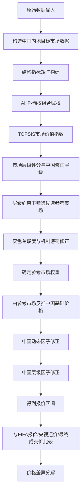
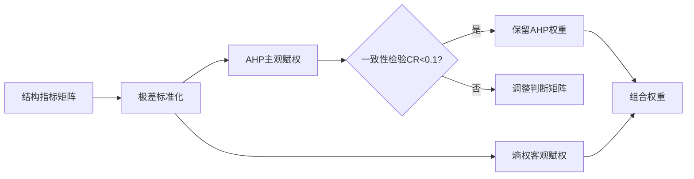
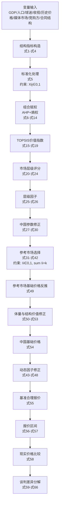

# 第三问模型建立：面向中国内地世界杯转播权价格的分层参考市场修正定价模型

## 1. 问题理解与建模目标

第三问的核心任务不是单纯预测某一市场的历史成交价，而是要在已有国际转播权交易数据、第二问参数寻优结果以及中国内地市场特殊结构的基础上，估计中国内地 2026 年世界杯转播权的合理报价区间，并进一步解释 FIFA 最初报价、央视还价、最终成交价之间的差异来源。

因此，本问建立的是一个“参考市场迁移 + 中国市场修正 + 谈判差异分解”的综合定价模型。模型的基本思想为：

先利用第二问中已经拟合和寻优得到的参数，继承国际市场转播权定价的一般规律；再针对中国内地市场存在的买方集中度高、版权商业化成熟度中等、有效竞购方较少、北美赛程时差不利等特征，对结构价值弹性、层级溢价强度、竞购系数和权利结构系数进行修正；随后通过结构 TOPSIS 计算中国与各已成交市场的综合市场价值指数，并用市场层级约束和灰色关联度选择最相似的参考市场；最后由参考市场价格反推中国基础价格，再乘以中国自身的动态修正因子和层级因子，得到保守报价、基准合理报价和进取报价。

本问最终要解决三个问题：

第一，基于国际可比市场，中国内地转播权的基础价值是多少；

第二，考虑 2026 年世界杯扩军、中国队是否参赛、时差、竞购强度和版权结构后，中国内地的合理报价区间是多少；

第三，FIFA 最初报价、央视还价和最终成交价之间的差异，分别可由扩军溢价、心理锚定、买方垄断压价、时差折价和残差因素解释多少。

---

## 2. 模型总体框架

第三问模型可表示为如下逻辑链：

其中，模型关键路径为：

[
\text{结构指标} \rightarrow \text{组合权重} \rightarrow \text{TOPSIS价值指数}
\rightarrow \text{市场层级} \rightarrow \text{灰色关联参考市场}
\rightarrow \text{基础价格} \rightarrow \text{动态修正} \rightarrow \text{报价区间}
]

这一流程使第三问既保持与第二问模型的一致性，又能够反映中国内地市场的特殊性。

---

## 3. 模型准备

### 3.1 数据准备

第三问所需数据包括两类。

第一类是已成交国家或地区的观测样本，用于构造参考市场集合。这些市场包括美国、日本、英国、德国、韩国、巴西、中国香港、澳大利亚、越南等。它们具有已知的 2026 年世界杯转播权成交价格，可以作为定价参照。

第二类是中国内地市场数据，用于构造目标市场样本。中国内地没有直接作为第二问训练样本进入参数拟合，而是在第三问中作为待估计市场加入模型。中国内地的输入变量包括人口规模、GDP、人均 GDP、球迷数量、历史收视热度、足球热度指数、体育媒体市场规模、历史转播权价格、赛程时段因子、主要竞购方数量、是否参赛、广播商数量和合同结构等。

模型还继承第二问分层市场模型的最优参数，包括参考市场数量 (k)、结构价值弹性系数 (\alpha)、GDP 对数敏感系数 (\gamma_1)、人口对数敏感系数 (\gamma_2)、层级溢价强度 (\eta)、扩军弹性 (\beta)、参赛上浮系数 (q)、未参赛折扣系数 (q_0)、竞购系数 (c)、权利结构系数 (\omega)。

---

### 3.2 中国内地市场特殊参数设定

根据改进后的代码，第三问对中国内地设置以下核心参数：

| 参数        |          符号 |   取值 | 含义                         |
| --------- | ----------: | ---: | -------------------------- |
| FIFA 最初报价 |       (P_F) |  275 | 取 2.5 亿至 3 亿美元区间中点，单位为百万美元 |
| 央视还价      |  (P_{CCTV}) |   55 | 央视谈判报价，单位为百万美元             |
| 最终成交价     | (P_{final}) |   60 | 最终成交价格，单位为百万美元             |
| 买方集中度     |     (HHI_C) | 0.82 | 表示中国内地市场买方高度集中             |
| 商业化成熟度    |       (m_C) | 0.60 | 表示中国内地体育版权商业化处于成长型水平       |
| 有效竞购方数量   |       (n_C) |    1 | 表示实际有效竞购主体较少               |
| 广播商数量     |       (b_C) |    1 | 表示主要版权承接方为央视               |
| 机制惩罚强度    |      (\tau) |  2.0 | 控制商业机制差异对参考市场权重的惩罚强度       |
| 报价下浮系数    |  (\delta_1) | 0.22 | 用于生成保守报价                   |
| 报价上浮系数    |  (\delta_2) | 0.27 | 用于生成进取报价                   |

---

## 4. 变量定义

### 4.1 决策变量

第三问本质上是转播权报价决策模型，因此决策变量主要包括参考市场选择变量和报价变量。

| 变量      | 含义                    | 类型   | 单位   | 约束范围                    |
| ------- | --------------------- | ---- | ---- | ----------------------- |
| (I_i)   | 是否选择市场 (i) 作为中国内地参考市场 | 离散变量 | 无    | (I_i \in {0,1})         |
| (R_C)   | 中国内地参考市场集合            | 集合变量 | 无    | (R_C={i:I_i=1})         |
| (P_C^0) | 中国内地基础价格              | 连续变量 | 百万美元 | (P_C^0 \ge 0)           |
| (P_C^M) | 中国内地基准合理报价            | 连续变量 | 百万美元 | (P_C^M \ge 0)           |
| (P_C^L) | 中国内地保守报价              | 连续变量 | 百万美元 | (0 \le P_C^L \le P_C^M) |
| (P_C^H) | 中国内地进取报价              | 连续变量 | 百万美元 | (P_C^H \ge P_C^M)       |

其中，(I_i) 虽然在代码中是通过“修正灰色关联度排序取前 (k) 个市场”实现的，但从建模角度可等价表示为一个离散选择变量。

---

### 4.2 中间变量

| 变量                   | 含义                      | 类型                    | 单位    | 约束范围                         |       |           |
| -------------------- | ----------------------- | --------------------- | ----- | ---------------------------- | ----- | --------- |
| (H_i)                | 市场 (i) 的历史收视热度          | 连续变量                  | 百万人等价 | (H_i \ge 0)                  |       |           |
| (F_i)                | 市场 (i) 的足球热度指数          | 连续变量                  | 无     | (F_i \in [0,1])              |       |           |
| (X_{ij})             | 市场 (i) 在指标 (j) 上的原始结构指标 | 连续变量                  | 依指标而定 | (X_{ij} \ge 0)               |       |           |
| (\widetilde{X}_{ij}) | 标准化后的结构指标               | 连续变量                  | 无     | (\widetilde{X}_{ij}\in[0,1]) |       |           |
| (w_j)                | 指标 (j) 的组合权重            | 连续变量                  | 无     | (w_j\ge0,\sum_j w_j=1)       |       |           |
| (V_i)                | 市场 (i) 的 TOPSIS 结构价值指数  | 连续变量                  | 无     | (V_i\in[0,1])                |       |           |
| (S_i)                | 市场 (i) 的原始层级评分          | 连续变量                  | 无     | 无固定范围                        |       |           |
| (S_C^{adj})          | 中国内地修正层级评分              | 连续变量                  | 无     | 无固定范围                        |       |           |
| (L_i)                | 市场 (i) 的市场层级            | 离散变量                  | 无     | (L_i\in{1,2,3,4,5})          |       |           |
| (\Lambda_i)          | 市场 (i) 的层级因子            | 连续变量                  | 无     | (\Lambda_i>0)                |       |           |
| (G_i)                | 中国与参考市场 (i) 的原始灰色关联度    | 连续变量                  | 无     | (G_i\in[0,1])                |       |           |
| (\mu_i)              | 市场 (i) 的商业机制成熟度         | 连续变量                  | 无     | (\mu_i\in[0,1])              |       |           |
| (\Pi_i)              | 机制惩罚因子                  | 连续变量                  | 无     | (\Pi_i\in(0,1])              |       |           |
| (\widehat{G}_i)      | 修正灰色关联度                 | 连续变量                  | 无     | (\widehat{G}_i\in[0,1])      |       |           |
| (\psi_i)             | 参考市场 (i) 的修正权重          | 连续变量                  | 无     | (\psi_i\ge0,\sum_i\psi_i=1)  |       |           |
| (D_C)                | 中国内地动态修正总因子             | 连续变量                  | 无     | (D_C>0)                      |       |           |
| (A_{C                | i})                     | 中国相对参考市场 (i) 的体量平滑乘数  | 连续变量  | 无                            | (A_{C | i}\ge0.1) |
| (B_{C                | i})                     | 中国相对参考市场 (i) 的结构弹性修正项 | 连续变量  | 无                            | (B_{C | i}>0)     |

---

### 4.3 目标变量

| 变量              | 含义                     | 类型   | 单位   | 约束范围                           |
| --------------- | ---------------------- | ---- | ---- | ------------------------------ |
| (P_C^M)         | 中国内地基准合理报价             | 连续变量 | 百万美元 | (P_C^M\ge0)                    |
| ([P_C^L,P_C^H]) | 中国内地合理报价区间             | 区间变量 | 百万美元 | (0\le P_C^L\le P_C^H)          |
| (\Delta_z)      | 某价格 (P_z) 相对模型基准报价的偏离率 | 连续变量 | %    | (\Delta_z\in(-\infty,+\infty)) |
| (\theta)        | 谈判权重                   | 连续变量 | 无    | 理论上 (\theta\in[0,1])           |
| (E_{expand})    | FIFA 扩军溢价              | 连续变量 | 百万美元 | 可正可负                           |
| (E_{anchor})    | FIFA 心理锚定溢价            | 连续变量 | 百万美元 | (E_{anchor}\ge0)               |
| (D_{mono})      | 央视买方垄断压价               | 连续变量 | 百万美元 | (D_{mono}\ge0)                 |
| (D_{time})      | 北美时差折价                 | 连续变量 | 百万美元 | 一般 (D_{time}\ge0)              |
| (R_{other})     | 其他残差                   | 连续变量 | 百万美元 | 可正可负                           |

---

## 5. 模型假设

### 假设 1：已成交国际市场可作为中国内地定价参照

认为美国、日本、英国、德国、韩国、巴西、中国香港、澳大利亚、越南等已成交市场的价格中包含了人口规模、经济水平、足球热度、历史收视、体育媒体市场规模、历史转播权价格等共同定价因素。因此，中国内地可通过与这些市场的结构相似性来推算合理基础价格。

合理性说明：第三问并非完全从零估计中国价格，而是基于第二问得到的国际市场定价规律进行迁移。参考市场法能够缓解单一国家样本不足的问题。

---

### 假设 2：中国内地存在明显买方集中效应

设中国内地买方集中度为 (HHI_C=0.82)，有效竞购方数量为 (n_C=1)，广播商数量为 (b_C=1)。这表示中国内地转播权市场中，央视具有较强的集中采购和议价能力。

合理性说明：世界杯在中国内地的核心转播渠道高度集中，市场并不完全符合欧美多平台竞购环境。因此必须对竞购系数、权利结构系数和层级溢价进行压缩修正。

---

### 假设 3：世界杯扩军、参赛状态、时差、竞购强度和权利结构对价格的影响可乘法分解

设动态修正总因子由内容增量因子、参赛因子、时差因子、竞购因子和权利结构因子相乘得到：

[
D_C=M_CQ_CT_CC_CR_C
]

合理性说明：这几个因素分别代表赛事供给变化、国家队参赛吸引力、收视便利性、版权竞购环境和版权包复杂度。它们的影响方向不同且相对独立，用乘法结构可以反映多因素共同放大或压缩价格的效果。

---

### 假设 4：短期突发事件不改变中国内地体育版权市场的长期结构

模型忽略突发政策变化、临时平台合作、临场营销事件、特殊公共事件等短期冲击，认为第三问价格主要由市场结构、经济体量、足球热度、历史收视和谈判机制决定。

合理性说明：题目关注的是转播权合理价格测算，而不是短期新闻事件驱动的交易价格波动。忽略突发事件有助于突出长期结构性因素。

---

### 假设 5：报价区间可由第二问模型误差经验修正得到

设保守报价和进取报价分别为：

[
P_C^L=P_C^M(1-\delta_1),\qquad P_C^H=P_C^M(1+\delta_2)
]

其中 (\delta_1=0.22)，(\delta_2=0.27)。

合理性说明：第二问已经通过已成交市场进行参数寻优和误差检验，第三问沿用其误差范围来构造报价区间，能够使报价结果避免单点估计过于绝对。

---

## 6. 结构指标构建

### 6.1 历史收视热度

对于中国内地和各参考市场，将不同口径的收视数据统一换算为“百万人等价”指标。设市场 (i) 第 (r) 类收视指标在 2022 年和 2018 年的数值分别为 (v_{ir,2022})、(v_{ir,2018})，单位换算系数为 (u_r)，则历史收视热度为：

[
H_i=\sum_r \frac{v_{ir,2022}+v_{ir,2018}}{2}\cdot u_r
\tag{1}
]

式（1）表示将近两届世界杯收视表现进行平均，并根据数据单位转换为统一口径。其物理意义是衡量市场对世界杯内容的历史消费强度。

---

### 6.2 足球热度指数

设市场 (i) 的 FIFA 排名为 (rank_i)，球迷比例为 (fanpct_i)，球迷数量为 (fans_i)，联赛强度得分为 (league_i)。先将 FIFA 排名转化为正向指标：

[
R_i=\frac{121-rank_i}{120}
\tag{2}
]

再构造足球热度指数：

[
F_i=0.25N(R_i)+0.30N(fanpct_i)+0.25N[\ln(1+fans_i)]+0.20N(league_i)
\tag{3}
]

其中 (N(\cdot)) 表示极差标准化。式（3）表示足球热度由国家队竞争力、球迷比例、球迷规模和本土联赛强度共同决定。权重设置体现出球迷基础和竞技水平对转播价值的重要影响。

---

### 6.3 结构指标矩阵

对于每个市场 (i)，构造六维结构指标向量：

[
\mathbf{X}_i=
\left[
\ln(1+H_i),
\ln(1+GDPpc_i),
\ln(1+fans_i),
F_i,
\ln(1+Media_i),
\ln(1+P_i^{hist})
\right]
\tag{4}
]

其中：

* (H_i) 表示历史收视热度；
* (GDPpc_i) 表示人均 GDP；
* (fans_i) 表示球迷数量；
* (F_i) 表示足球热度指数；
* (Media_i) 表示体育媒体市场规模；
* (P_i^{hist}) 表示历史转播权价格。

式（4）使用对数处理，是为了降低 GDP、人口、历史价格等大尺度变量的数量级差异，避免极端大市场对模型产生过强支配。

---

## 7. 指标标准化与组合赋权

### 7.1 基于观测市场的标准化

由于中国内地是待估计市场，不能直接用中国内地参与确定最大值和最小值，否则会改变参考市场尺度。因此，以已成交观测市场为参照，对全部市场进行标准化：

[
\widetilde{X}_{ij}
==================

\mathrm{clip}
\left(
\frac{X_{ij}-\min_{r\in O}X_{rj}}
{\max_{r\in O}X_{rj}-\min_{r\in O}X_{rj}},
0,1
\right)
\tag{5}
]

其中，(O) 表示已成交观测市场集合，(\mathrm{clip}(\cdot)) 表示将结果截断到 ([0,1]) 范围内。

式（5）的意义是：所有市场都在同一国际已成交市场尺度下比较，避免中国内地因自身规模过大而扭曲标准化边界。

---

### 7.2 AHP 主观权重

设结构指标个数为 (m=6)，构造 AHP 判断矩阵：

[
A=(a_{ij})_{m\times m}
\tag{6}
]

其中 (a_{ij}) 表示指标 (i) 相对于指标 (j) 的重要性。通过特征向量法得到主观权重：

[
A\mathbf{w}^{AHP}=\lambda_{\max}\mathbf{w}^{AHP}
\tag{7}
]

并进行一致性检验：

[
CI=\frac{\lambda_{\max}-m}{m-1}
\tag{8}
]

[
CR=\frac{CI}{RI}
\tag{9}
]

当 (CR<0.1) 时，认为判断矩阵具有可接受的一致性。式（7）至式（9）的作用是将专家判断转化为可计算的指标权重，并检验权重设定是否存在明显逻辑矛盾。

---

### 7.3 熵权法客观权重

为避免完全依赖主观判断，引入熵权法。设：

[
p_{ij}=\frac{\widetilde{X}*{ij}}{\sum_i \widetilde{X}*{ij}}
\tag{10}
]

则第 (j) 个指标的信息熵为：

[
e_j=-\frac{1}{\ln n}\sum_{i=1}^{n}p_{ij}\ln p_{ij}
\tag{11}
]

差异系数为：

[
d_j=1-e_j
\tag{12}
]

客观权重为：

[
w_j^{E}=\frac{d_j}{\sum_{j=1}^{m}d_j}
\tag{13}
]

式（10）至式（13）表示：某指标在各市场之间差异越大，其携带的信息越多，权重越高。

---

### 7.4 组合权重

将 AHP 主观权重和熵权客观权重组合，得到最终结构指标权重：

[
w_j=
\frac{\lambda w_j^{AHP}+(1-\lambda)w_j^E}
{\sum_{j=1}^{m}[\lambda w_j^{AHP}+(1-\lambda)w_j^E]}
\tag{14}
]

其中 (\lambda\in[0,1]) 表示主观权重和客观权重的相对重要性。若不特别强调主观或客观偏好，可取 (\lambda=0.5)。

式（14）的物理意义是：既保留专家对转播权价值指标的经验判断，又引入数据本身的离散程度，提升权重设定的稳健性。

---

## 8. TOPSIS 市场结构价值指数

在得到标准化矩阵和组合权重后，构造加权标准化矩阵：

[
Z_{ij}=w_j\widetilde{X}_{ij}
\tag{15}
]

正理想解和负理想解分别为：

[
Z_j^+=\max_i Z_{ij},\qquad Z_j^-=\min_i Z_{ij}
\tag{16}
]

市场 (i) 到正理想解和负理想解的距离为：

[
D_i^+=\sqrt{\sum_{j=1}^{m}(Z_{ij}-Z_j^+)^2}
\tag{17}
]

[
D_i^-=\sqrt{\sum_{j=1}^{m}(Z_{ij}-Z_j^-)^2}
\tag{18}
]

于是市场 (i) 的结构价值指数为：

[
V_i=\frac{D_i^-}{D_i^++D_i^-}
\tag{19}
]

其中 (V_i\in[0,1])。(V_i) 越接近 1，说明市场越接近高价值理想市场；(V_i) 越接近 0，说明市场结构价值越低。

式（19）在第三问中的作用是把历史收视、人均 GDP、球迷数量、足球热度、体育媒体市场规模、历史价格等多个指标压缩为一个综合价值指数，用于后续参考市场迁移定价。

---

## 9. 市场层级判定模型

### 9.1 权利结构复杂度

设市场 (i) 的合同结构拆分数量为 (parts_i)，是否包含打包版权为 (package_i)，广播商数量为 (b_i)，则权利结构复杂度为：

[
C_i=parts_i+0.5package_i+0.5b_i
\tag{20}
]

式（20）表示：合同结构越复杂、版权包越多、参与广播商越多，市场商业化和版权拆分程度越高。

---

### 9.2 层级评分

选取总 GDP、人口规模、体育媒体市场规模、历史转播权价格、主要竞购方数量和权利结构复杂度六个变量计算层级评分。对每个变量进行基于观测市场的 Z-score 标准化：

[
Z_{ij}=\frac{x_{ij}-\overline{x_j}}{\sigma_j}
\tag{21}
]

其中 (\overline{x_j}) 和 (\sigma_j) 分别为已成交观测市场中指标 (j) 的均值和标准差。

市场 (i) 的原始层级评分为：

[
S_i=\frac{1}{6}
\left(
Z_{i,GDP}+Z_{i,POP}+Z_{i,Media}+Z_{i,HistPrice}+Z_{i,Bidder}+Z_{i,Right}
\right)
\tag{22}
]

式（22）表示市场层级由经济体量、人口体量、体育媒体市场规模、历史成交基础、竞购活跃度和权利结构复杂度共同决定。

---

### 9.3 层级划分

根据观测市场原始层级评分的 20%、40%、60%、80% 分位点，将市场划分为 5 个层级：

[
L_i=
\begin{cases}
5, & S_i\ge Q_{80}\
4, & Q_{60}\le S_i<Q_{80}\
3, & Q_{40}\le S_i<Q_{60}\
2, & Q_{20}\le S_i<Q_{40}\
1, & S_i<Q_{20}
\end{cases}
\tag{23}
]

其中，层级标签对应为：

[
5\rightarrow S,\quad
4\rightarrow A,\quad
3\rightarrow B,\quad
2\rightarrow C,\quad
1\rightarrow D
]

式（23）的意义是用国际已成交市场自身的分布来确定层级，而不是主观指定阈值。

---

### 9.4 中国内地层级修正

由于中国内地虽然人口和 GDP 体量较大，但有效竞购方少、版权商业化成熟度中等、赛程时差不利，因此不能只按经济规模判断层级。设中国内地原始层级评分为 (S_C)，赛程时段因子为 (s_C)，商业化成熟度为 (m_C)，买方集中度为 (HHI_C)，则修正层级评分为：

[
S_C^{adj}
=========

S_C
-\lambda_1HHI_C
-\lambda_2(1-s_C)
-\lambda_3(1-m_C)
\tag{24}
]

其中，(\lambda_1,\lambda_2,\lambda_3) 分别表示买方集中、时差不利和商业化不足对层级评分的扣减强度。

式（24）的物理意义是：中国内地具备大市场规模，但其转播权价格不能简单按美国、日本等高商业化市场外推，因此需要对市场层级进行约束性修正。

---

### 9.5 层级因子

设市场 (i) 的层级为 (L_i)，层级溢价强度为 (\eta)，则层级因子为：

[
\Lambda_i=\exp[\eta(L_i-3)]
\tag{25}
]

当 (L_i>3) 时，(\Lambda_i>1)，表示高层级市场存在溢价；当 (L_i<3) 时，(\Lambda_i<1)，表示低层级市场存在折价。

对于中国内地，使用经过买方集中度修正后的层级溢价强度 (\eta_C)：

[
\Lambda_C=\exp[\eta_C(L_C-3)]
\tag{26}
]

---

## 10. 中国市场参数修正模型

第二问得到的是国际市场一般参数，但中国内地市场具有买方集中度高、有效竞购弱、版权结构相对集中等特征。因此对部分参数进行修正。

设第二问最优参数为：

[
\alpha^*,\eta^*,c^*,\omega^*
]

则中国内地修正参数为：

[
\alpha_C=\max{\alpha^*(1-\rho_\alpha HHI_C),0.05}
\tag{27}
]

[
\eta_C=\max{\eta^*(1-\rho_\eta HHI_C),0.05}
\tag{28}
]

[
c_C=\max{c^*(1-HHI_C),0}
\tag{29}
]

[
\omega_C=\max{\omega^*(1-\rho_\omega HHI_C),0}
\tag{30}
]

式（27）表示买方越集中，中国结构价值指数对价格的放大弹性越弱。

式（28）表示买方集中度越高，高市场层级带来的价格溢价越难完全兑现。

式（29）表示中国内地有效竞购不足，因此竞购强度对价格的推动作用被压缩。

式（30）表示中国内地版权结构相对集中，权利拆分带来的溢价有限。

---

## 11. 参考市场选择模型

### 11.1 候选市场层级约束

为避免直接用美国等过高商业化市场或越南等低层级市场不加筛选地外推，先设置候选参考市场集合：

[
A_C={i\ne C:|L_i-L_C|\le1}
\tag{31}
]

式（31）表示只有与中国内地层级相差不超过 1 级的市场，才可以作为候选参考市场。

---

### 11.2 灰色关联度

设中国内地标准化结构指标为 (\widetilde{X}*{Cj})，候选市场 (i) 的标准化指标为 (\widetilde{X}*{ij})，则两者在指标 (j) 上的差异为：

[
\Delta_{ij}=|\widetilde{X}*{Cj}-\widetilde{X}*{ij}|
\tag{32}
]

灰色关联系数为：

[
\xi_{ij}
========

\frac{\Delta_{\min}+\zeta \Delta_{\max}}
{\Delta_{ij}+\zeta \Delta_{\max}}
\tag{33}
]

其中 (\zeta\in(0,1)) 为分辨系数，通常取 0.5。进一步得到市场 (i) 与中国内地的原始灰色关联度：

[
G_i=\sum_{j=1}^{m}w_j\xi_{ij}
\tag{34}
]

式（34）的意义是：若某参考市场在多个结构指标上与中国内地接近，则其灰色关联度更高，更适合作为价格迁移参照。

---

### 11.3 商业机制惩罚因子

仅结构相似并不够，因为部分市场虽然人口或经济指标接近中国，但体育版权商业化机制可能不同。模型进一步构造商业机制成熟度：

[
\mu_i=0.6M_i+0.4K_i
\tag{35}
]

其中 (M_i) 表示媒体转播市场成熟度，(K_i) 表示竞购强度水平。

为了惩罚与中国内地商业机制差异过大的参考市场，定义机制惩罚因子：

[
\Pi_i=\exp[-\tau|\mu_i-m_C|]
\tag{36}
]

修正灰色关联度为：

[
\widehat{G}_i=G_i\Pi_i
\tag{37}
]

式（36）和式（37）的物理意义是：即使某市场结构指标与中国接近，如果其版权商业化成熟度和竞购机制与中国差异较大，其参考价值也应下降。

---

### 11.4 参考市场选择目标函数

选择修正灰色关联度最高的前 (k) 个市场作为中国内地参考市场。从优化角度，可表示为：

[
\max_{I_i}\sum_{i\in A_C}I_i\widehat{G}_i
\tag{38}
]

约束条件为：

[
\sum_{i\in A_C}I_i=k
\tag{39}
]

[
I_i\in{0,1}
\tag{40}
]

[
|L_i-L_C|\le1
\tag{41}
]

式（38）表示在候选市场中选择与中国最相似、且商业机制最接近的参考市场组合。式（39）控制参考市场数量，式（40）表示是否选择某市场，式（41）表示层级约束。

选出参考市场后，其修正权重为：

[
\psi_i=\frac{\widehat{G}*i}{\sum*{r\in R_C}\widehat{G}_r}
\tag{42}
]

式（42）保证所有参考市场权重之和为 1。

---

## 12. 中国内地动态修正因子

中国内地最终报价不仅取决于静态结构价值，还取决于 2026 年世界杯本身的动态特征。模型构造五类动态因子。

### 12.1 内容增量因子

2026 年世界杯由 64 场扩充至 104 场，设扩军弹性为 (\beta_C)，则内容增量因子为：

[
M_C=\left(\frac{104}{64}\right)^{\beta_C}
\tag{43}
]

式（43）表示比赛数量增加会提升版权内容供给，但价格增幅不一定与场次数量等比例，因此使用弹性指数 (\beta_C)。

---

### 12.2 参赛因子

设中国队是否参赛变量为 (qual_C)。若中国队参赛，转播价值上升；若未参赛，则存在折扣：

[
Q_C=
\begin{cases}
1+q, & qual_C=1\
1-q_0, & qual_C=0
\end{cases}
\tag{44}
]

式（44）表示本国球队参赛会显著增强本地观众关注度，未参赛则削弱本地市场吸引力。

---

### 12.3 时差因子

设中国内地观赛友好度或赛程时段因子为 (s_C)，则时差因子为：

[
T_C=0.65+0.35s_C
\tag{45}
]

式（45）表示即使赛程不利，世界杯仍具有基础收视价值，因此设置 0.65 的基础项；同时根据时段友好程度给予最高 0.35 的增益。

---

### 12.4 竞购因子

设中国内地有效竞购方数量为 (n_C)，修正竞购系数为 (c_C)，则：

[
C_C=1+c_C\ln[\max(n_C,1)]
\tag{46}
]

当 (n_C=1) 时，(\ln(1)=0)，竞购因子为 1，说明不存在多方竞价推高价格的作用。

---

### 12.5 权利结构因子

设中国内地广播商数量为 (b_C)，修正权利结构系数为 (\omega_C)，则：

[
R_C=1+\omega_C[\max(b_C,1)-1]
\tag{47}
]

当 (b_C=1) 时，权利结构因子为 1，说明单一广播商结构不会带来额外版权拆分溢价。

---

### 12.6 动态修正总因子

综合以上五类因子，得到中国内地动态修正总因子：

[
D_C=M_CQ_CT_CC_CR_C
\tag{48}
]

式（48）表示 2026 年扩军、是否参赛、时差、竞购强度和权利结构共同作用于中国内地转播权价格。

---

## 13. 中国内地价格推导模型

### 13.1 参考市场基础价格反推

设参考市场 (i) 的 2026 年成交价为 (P_i^{2026})，动态修正因子为 (D_i)，层级因子为 (\Lambda_i)。为剥离动态因素和层级因素，先反推参考市场基础价格：

[
P_i^0=\frac{P_i^{2026}}{D_i\Lambda_i}
\tag{49}
]

式（49）的物理意义是：将已成交价格还原为不含赛事动态溢价和市场层级溢价的基础价格，便于向中国内地迁移。

---

### 13.2 体量平滑乘数

中国内地与参考市场在 GDP 和人口规模上可能存在较大差异。设中国内地 GDP 和人口分别为 (GDP_C,POP_C)，参考市场为 (GDP_i,POP_i)，则体量平滑乘数为：

[
A_{C|i}
=======

\max
\left[
0.1,,
1+\gamma_{1C}\ln\left(\frac{GDP_C}{GDP_i}\right)
+\gamma_{2C}\ln\left(\frac{POP_C}{POP_i}\right)
\right]
\tag{50}
]

式（50）表示：当中国经济和人口体量大于参考市场时，基础价格应上调；反之应下调。设置下限 0.1 是为了避免极端缩放导致价格为负或过低。

---

### 13.3 结构价值弹性修正项

设中国内地 TOPSIS 结构价值指数为 (V_C)，参考市场 (i) 的结构价值指数为 (V_i)，则结构价值比为：

[
R_{C|i}=\frac{V_C}{V_i}
\tag{51}
]

结构弹性修正项为：

[
B_{C|i}=R_{C|i}^{\alpha_C}
\tag{52}
]

式（52）表示：中国内地综合市场价值指数相对参考市场越高，由参考市场推算出的中国基础价格越高；但由于中国买方集中度高，弹性 (\alpha_C) 已经经过压缩，不会简单按规模无限放大。

---

### 13.4 单一参考市场推得的中国基础价格

由参考市场 (i) 推得的中国内地基础价格为：

[
\widehat{P}*{C|i}^0=P_i^0A*{C|i}B_{C|i}
\tag{53}
]

式（53）表示：参考市场基础价格经过经济人口体量修正和结构价值弹性修正后，转化为中国内地基础价格估计。

---

### 13.5 多参考市场加权融合

综合所有入选参考市场，得到中国内地基础价格：

[
P_C^0=\sum_{i\in R_C}\psi_i\widehat{P}_{C|i}^0
\tag{54}
]

式（54）表示：与中国越相似、商业机制越接近的参考市场，其价格迁移结果占比越高。

---

### 13.6 中国内地基准合理报价

将中国内地基础价格乘以中国动态修正总因子和中国层级因子，得到基准合理报价：

[
P_C^M=P_C^0D_C\Lambda_C
\tag{55}
]

式（55）是第三问定价模型的核心公式。其中：

* (P_C^0) 反映中国内地静态基础价格；
* (D_C) 反映 2026 年赛事动态因素；
* (\Lambda_C) 反映中国内地市场层级溢价或折价。

---

### 13.7 合理报价区间

为避免单点估计过于绝对，根据第二问模型误差经验构造报价区间：

[
P_C^L=P_C^M(1-\delta_1)
\tag{56}
]

[
P_C^H=P_C^M(1+\delta_2)
\tag{57}
]

其中 (P_C^L) 为保守报价，(P_C^M) 为基准合理报价，(P_C^H) 为进取报价。

式（56）和式（57）的物理意义是：考虑数据误差、谈判弹性和市场不确定性后，合理价格不应只给出单点，而应给出区间。

---

## 14. 现实价格比较与偏离率

设某一现实价格或报价为 (P_z)，例如 FIFA 最初报价、央视还价、最终成交价，则其相对模型基准报价的偏离率为：

[
\Delta_z=\frac{P_z-P_C^M}{P_C^M}
\tag{58}
]

当 (\Delta_z>0) 时，说明该价格高于模型合理基准，可能包含溢价或报价锚定；

当 (\Delta_z<0) 时，说明该价格低于模型合理基准，可能受到买方压价、时差不利或谈判优势影响。

---

## 15. 价格差异分解模型

第三问不仅要计算合理报价，还要解释 FIFA 最初报价、央视还价和最终成交价之间的差异。因此构造价格差异分解模型。

### 15.1 FIFA 扩军溢价

FIFA 报价可能更强调 2026 年世界杯扩军带来的内容增量。设 FIFA 视角下的扩军弹性为：

[
\beta_F=\min(\beta_C+\beta_{extra},0.85)
\tag{59}
]

则 FIFA 扩军溢价为：

[
E_{expand}
==========

P_C^0
\left[
\left(\frac{104}{64}\right)^{\beta_F}
-------------------------------------

\left(\frac{104}{64}\right)^{\beta_C}
\right]
\tag{60}
]

式（60）表示 FIFA 可能比买方更重视扩军带来的内容增量，因此其报价中包含额外扩军溢价。

---

### 15.2 FIFA 心理锚定溢价

设 FIFA 报价锚定率为 (r_A)，则心理锚定溢价为：

[
E_{anchor}=r_AP_C^M
\tag{61}
]

式（61）表示卖方在谈判初期往往会给出高于合理成交价的报价，以形成谈判锚点。

---

### 15.3 FIFA 总溢价

[
E_{FIFA}=E_{expand}+E_{anchor}
\tag{62}
]

式（62）表示 FIFA 高报价可被拆分为赛事扩军价值判断偏高和谈判锚定两个部分。

---

### 15.4 央视买方垄断压价

设买方垄断压价强度为 (\lambda_m)，则央视买方垄断压价为：

[
D_{mono}=P_C^M\lambda_mHHI_C
\tag{63}
]

式（63）表示买方集中度越高，央视越有能力通过议价压低成交价格。

---

### 15.5 北美时差折价

由于 2026 年世界杯主要在北美举办，中国内地观赛时间存在不利因素。设时差因子为 (T_C)，则时差折价为：

[
D_{time}=P_C^M\left(\frac{1}{T_C}-1\right)
\tag{64}
]

当 (T_C<1) 时，(D_{time}>0)，表示时差不利造成价格折扣。

---

### 15.6 其他残差

设 FIFA 最初报价为 (P_F)，最终成交价为 (P_{final})，则其他残差为：

[
R_{other}
=========

P_F-P_{final}
-E_{FIFA}
-D_{mono}
-D_{time}
\tag{65}
]

式（65）表示除扩军溢价、心理锚定、买方压价和时差折价之外，仍无法解释的价格差异，可能来自谈判策略、付款结构、版权范围、合作关系、信息不对称等因素。

---

### 15.7 谈判权重

设央视还价为 (P_{CCTV})，则最终成交价在央视还价和 FIFA 最初报价之间的位置可用谈判权重表示：

[
\theta=
\frac{P_{final}-P_{CCTV}}{P_F-P_{CCTV}}
\tag{66}
]

当 (\theta\to0) 时，说明最终成交价更接近央视还价，买方议价能力较强；

当 (\theta\to1) 时，说明最终成交价更接近 FIFA 报价，卖方议价能力较强。

---

## 16. 模型约束条件汇总

第三问模型的主要约束包括：

### 16.1 权重约束

[
w_j\ge0,\qquad \sum_{j=1}^{m}w_j=1
\tag{67}
]

[
\psi_i\ge0,\qquad \sum_{i\in R_C}\psi_i=1
\tag{68}
]

式（67）保证结构指标权重可解释，式（68）保证参考市场加权价格为凸组合。

---

### 16.2 标准化约束

[
0\le \widetilde{X}_{ij}\le1
\tag{69}
]

式（69）保证所有结构指标在统一尺度下比较。

---

### 16.3 参考市场选择约束

[
I_i\in{0,1}
\tag{70}
]

[
\sum_{i\in A_C}I_i=k
\tag{71}
]

[
|L_i-L_C|\le1
\tag{72}
]

式（70）表示是否选择某参考市场，式（71）表示参考市场数量固定为第二问最优参数 (k)，式（72）表示层级相近约束。

---

### 16.4 报价非负约束

[
P_C^0\ge0,\qquad P_C^M\ge0,\qquad P_C^L\ge0,\qquad P_C^H\ge0
\tag{73}
]

---

### 16.5 报价区间约束

[
P_C^L\le P_C^M\le P_C^H
\tag{74}
]

式（74）保证保守报价、基准报价和进取报价之间具有合理顺序。

---

## 17. 建模步骤

### 步骤 1：读取第二问最优参数

从第二问分层市场模型的参数寻优结果中读取：

[
k,\alpha^*,\gamma_1^*,\gamma_2^*,\eta^*,\beta^*,q,q_0,c^*,\omega^*
]

若未读取到参数文件，则使用默认参数作为备选。这一步保证第三问与第二问模型保持一致。

---

### 步骤 2：构造中国内地目标市场样本

读取中国内地的经济数据、足球市场数据、历史转播权数据、历史收视数据、时区友好度数据和市场结构数据，合并为中国内地目标行。

若总 GDP 缺失，则用人口规模和人均 GDP 估算：

[
GDP_C=\frac{POP_C\cdot GDPpc_C}{1000}
\tag{75}
]

式（75）中的人口单位为百万人，人均 GDP 单位为美元，因此除以 1000 后得到十亿美元口径。

---

### 步骤 3：构造结构指标矩阵

对中国内地和已成交市场统一构造六维结构指标：

[
\ln(1+H_i),\ln(1+GDPpc_i),\ln(1+fans_i),F_i,\ln(1+Media_i),\ln(1+P_i^{hist})
]

此处需要检查变量之间是否存在严重重复，例如球迷数量与历史收视热度可能相关，但二者含义不同：前者表示潜在观众基础，后者表示真实历史消费强度，因此可以同时保留。

---

### 步骤 4：标准化与组合赋权

以已成交市场为参考尺度，对所有市场结构指标进行标准化。随后使用 AHP 权重和熵权法权重生成组合权重。

关键检查节点：

---

### 步骤 5：计算 TOPSIS 市场价值指数

使用组合权重计算各市场的 TOPSIS 结构价值指数 (V_i)。该指数用于衡量市场综合转播价值，并进入后续结构弹性修正。

---

### 步骤 6：划分市场层级并修正中国层级

先用 GDP、人口、体育媒体市场规模、历史转播权价格、竞购方数量和权利结构复杂度计算市场层级评分 (S_i)，再根据分位数划分市场层级 (L_i)。

对于中国内地，进一步用买方集中度、时差不利和商业化成熟度进行扣减，得到修正层级评分 (S_C^{adj})，并确定中国层级 (L_C)。

---

### 步骤 7：修正中国内地定价参数

根据中国内地买方集中度 (HHI_C)，对结构价值弹性、层级溢价强度、竞购系数和权利结构系数进行压缩修正，得到：

[
\alpha_C,\eta_C,c_C,\omega_C
]

这一步是第三问改进模型的关键，因为它避免了直接把欧美多平台竞购市场的价格规律生硬套用到中国内地。

---

### 步骤 8：筛选参考市场

先用层级约束筛选候选市场：

[
|L_i-L_C|\le1
]

再计算灰色关联度 (G_i)，并引入商业机制惩罚因子 (\Pi_i)，得到修正灰色关联度：

[
\widehat{G}_i=G_i\Pi_i
]

选择修正灰色关联度最高的前 (k) 个市场作为参考市场，并计算权重 (\psi_i)。

---

### 步骤 9：由参考市场反推中国基础价格

对每个参考市场，先剥离其动态因子和层级因子：

[
P_i^0=\frac{P_i^{2026}}{D_i\Lambda_i}
]

再根据中国与参考市场的 GDP、人口、结构价值指数差异，得到该参考市场推导出的中国基础价格：

[
\widehat{P}*{C|i}^0=P_i^0A*{C|i}B_{C|i}
]

最后加权融合：

[
P_C^0=\sum_{i\in R_C}\psi_i\widehat{P}_{C|i}^0
]

---

### 步骤 10：计算中国动态修正因子

计算内容增量因子、参赛因子、时差因子、竞购因子和权利结构因子，并得到：

[
D_C=M_CQ_CT_CC_CR_C
]

---

### 步骤 11：生成合理报价区间

计算基准合理报价：

[
P_C^M=P_C^0D_C\Lambda_C
]

并生成保守报价和进取报价：

[
P_C^L=P_C^M(1-\delta_1)
]

[
P_C^H=P_C^M(1+\delta_2)
]

---

### 步骤 12：现实价格比较与分解

将模型报价与 FIFA 最初报价、央视还价、最终成交价进行比较，并计算相对偏离率。

进一步将 FIFA 报价与最终成交价之间的差异分解为：

[
\text{价格差异}
===========

\text{FIFA扩军溢价}
+
\text{FIFA心理锚定溢价}
+
\text{央视买方垄断压价}
+
\text{北美时差折价}
+
\text{其他残差}
]

---

## 18. “变量—公式—约束—目标”建模流程图

---

## 19. 模型特点与改进意义

与只用单一回归或简单倍数法相比，本问改进模型具有以下优点。

第一，模型继承了第二问的参数寻优结果，使第三问不是重新构造孤立模型，而是建立在前两问统一逻辑之上。

第二，模型引入中国内地买方集中度 (HHI_C)，对结构价值弹性、层级溢价、竞购系数和权利结构系数进行修正，能够更准确反映中国内地“市场体量大但竞购机制弱”的特点。

第三，模型使用层级约束筛选参考市场，避免把中国内地直接与美国等高度商业化市场进行过度外推，也避免使用越南等低层级市场造成低估。

第四，模型使用灰色关联度衡量结构相似性，并引入商业机制惩罚因子，使参考市场选择同时考虑“指标相似”和“机制相似”。

第五，模型不仅给出合理报价区间，还进一步分解 FIFA 报价、央视还价和最终成交价之间的差异，使结果具有解释性，而不是只给出一个预测数值。

---

## 20. 最终模型表达式汇总

第三问最终定价模型可概括为：

[
P_C^M
=====

\left[
\sum_{i\in R_C}
\psi_i
\cdot
\frac{P_i^{2026}}{D_i\Lambda_i}
\cdot
A_{C|i}
\cdot
B_{C|i}
\right]
\cdot
D_C
\cdot
\Lambda_C
\tag{76}
]

其中：

[
A_{C|i}
=======

\max
\left[
0.1,,
1+\gamma_{1C}\ln\left(\frac{GDP_C}{GDP_i}\right)
+\gamma_{2C}\ln\left(\frac{POP_C}{POP_i}\right)
\right]
\tag{77}
]

[
B_{C|i}
=======

\left(\frac{V_C}{V_i}\right)^{\alpha_C}
\tag{78}
]

[
D_C
===

\left(\frac{104}{64}\right)^{\beta_C}
Q_C
T_C
C_C
R_C
\tag{79}
]

[
\Lambda_C=\exp[\eta_C(L_C-3)]
\tag{80}
]

报价区间为：

[
\boxed{
P_C^L=P_C^M(1-\delta_1)
}
\tag{81}
]

[
\boxed{
P_C^H=P_C^M(1+\delta_2)
}
\tag{82}
]

因此，中国内地 2026 年世界杯转播权的合理报价结果为：

[
\boxed{
P_C\in[P_C^L,P_C^H]
}
\tag{83}
]

其中 (P_C^M) 为基准合理报价，([P_C^L,P_C^H]) 为考虑模型误差与谈判不确定性的合理报价区间。
